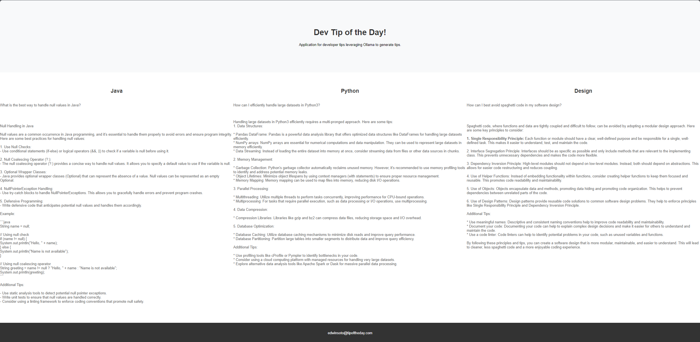
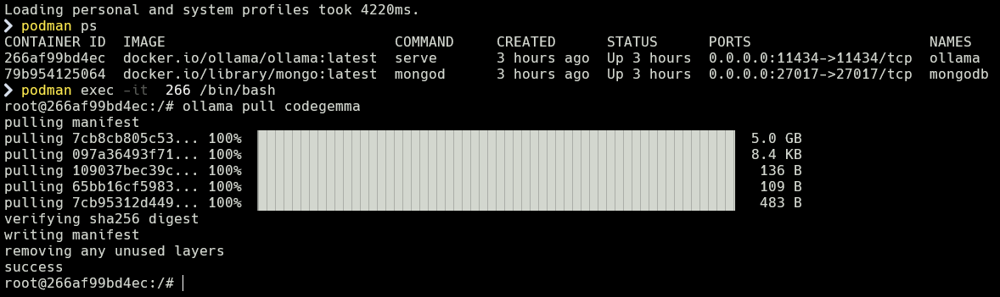

# Tip of the Day
A Sring Web application that leverages Ollama to generate a tip for three different topics for each day.



# Purpose:
The purpose of this project is to apply the knowledge and skills i have acquired while learning Java. Through this project, I aim to implement various concepts learned and solidify my understanding of these topics. 

# Setup:

Pre-Requisites:
- Docker & Docker-Compose
- Intellij w/ Gateway installed
- [DevPod](https://devpod.sh/)

>[!NOTE]
> I did try to run this natively with Intellij using devcontainer but ran into issues. 
> 

## Steps to setup locally:
1. Clone project locally
2. Utilizing devpod ensure docker provider is configured
   1. Create new workspace for this project utilizing folder
   2. Select default ide **intellij**
   3. Name workspace 
   4. Update devcontainer Path:
      5. `.devcontiner/devcontainer.json`

>[!IMPORTANT]
> For every fresh volume you will need to run teh below to update ollama
> 
3. Once Containers are up and running we will need to exec commands within the ollama container
   - List all running containers
```shell 
docker ps | grep ollama
```
   - Get the first 3-5 characters of the container id and we will enter into the container terminal
```shell
docker exec -it xxxx /bin/bash
```
   - Install "codegemma" model in container
```sh 
ollama pull codegemma
```
Once complete you can exit the terminal



# How to Use:

At this time the API endpoint to store the data in mongo is triggered to run automatically starting at midnight. For
initial startup of the app you will need to hit the endpoint. Due to the processing required to generate a response it
is best to run each endpoint one at time until the response has generated.
Once you have data retrieved and stored in mongo the response can be retrieved and viewed on the home page.

| Endpoint                                                   | Scheduled |
|------------------------------------------------------------|-----------|
| [Home](http://localhost:8080/)                             | N/A       |
| [Java Tip Endpoint](http://localhost:8080/ollama/java)     | 12:01 AM  |
| [Python Tip Endpoint](http://localhost:8080/ollama/python) | 12:05 AM  |
| [Design Tip Endpoint](http://localhost:8080/ollama/design) | 12:10 AM  |


